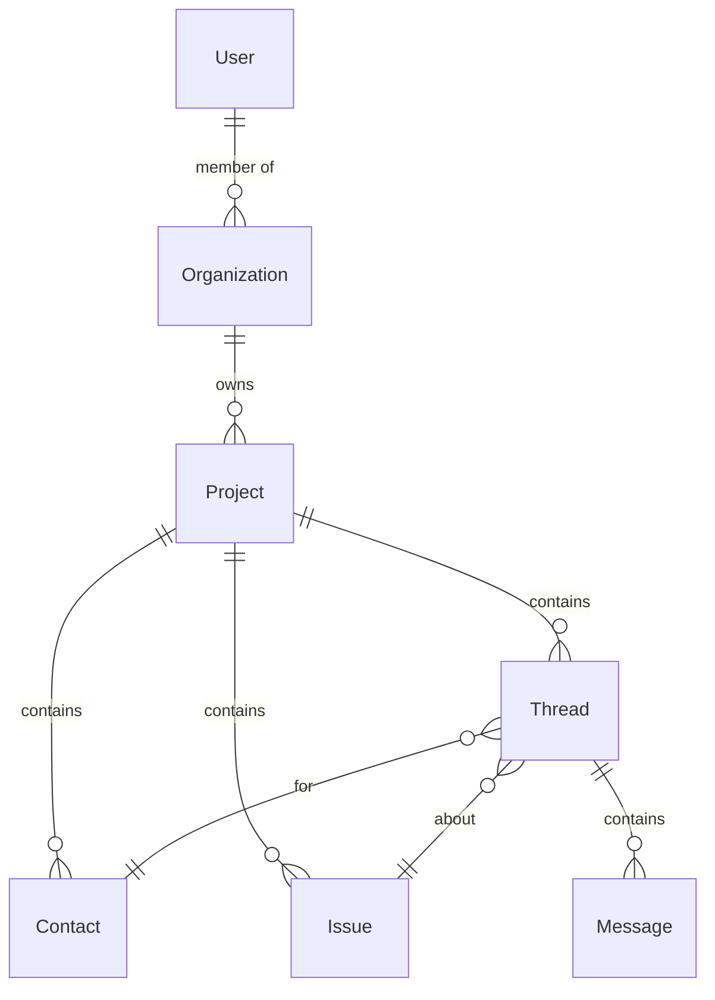

# Platform Hierarchy

```
User (authenticated)
  └── Organization (billing, users, settings)
       └── Project (job site with dedicated AI agent)
            ├── Threads (Contact + Issue mapping)
            ├── Issues (root causes)
            ├── Knowledge Base
            └── Contacts
```

## Access Model

- Users belong to one or more Organizations
- Within an org, users have a Role: Owner, Admin, Member, Viewer
- Role determines access to all projects in the organization

## Entity Relationships



## Data Isolation

- All data siloed at Organization level
- Cross-org queries prohibited
- Project data isolated within org
