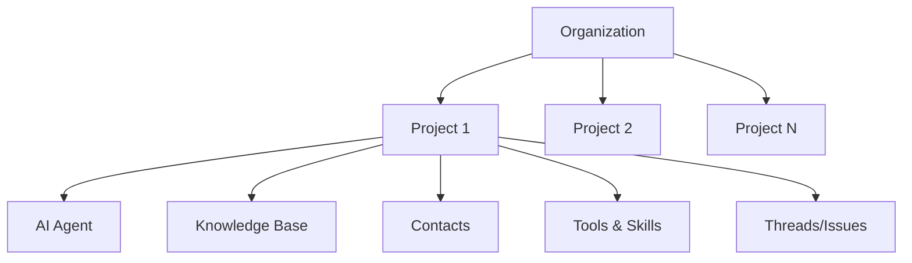

# Agent Maple Console: Functional Overview

The Agent Maple Console is a **configuration and reporting interface** for managing AI-powered communication agents deployed at construction job sites. It provides operators with visibility into agent activity, root cause tracking, and the ability to configure agent behavior and knowledge.

> [!IMPORTANT]
> The console does **not** handle real-time conversations—those happen autonomously via the AI agents across Voice, SMS, and Email channels. This interface is for **oversight, configuration, and analytics**.

---

## Platform Hierarchy

| Level | Purpose | Example |
|-------|---------|---------|
| **Organization** | Billing entity, user management, global settings | *Iron Maple Construction* |
| **Project** | Physical job site with dedicated AI agent | *Site-A Plaza*, *Site-B Warehouse* |

---

## Core Data Concepts

### Threads
**Units of work**: One customer conversation about one problem.
- Short-lived, owned by the AI agent.
- May span multiple channels (Voice → SMS → Email = 1 thread).
- **Console function**: Read-only oversight; monitor status and agent progress.

### Issues
**Root causes**: Long-lived analytical problems explaining *why* threads exist.
- One Issue links to many Threads.
- **Console function**: Read-only oversight; monitor root cause patterns and resolution status.

---

## Console Views

### 1. Organization Selection
Entry point for multi-org users. Displays all organizations the user has access to.

**Configuration**: None (read-only)
**Reporting**: Organization count, project counts per org

---

### 2. Projects Grid
Overview of all job sites within an organization.

**Configuration**:
- Launch new project (provisions AI agent)
- Set agent online/offline status

**Reporting**:
- Agent status (Online, Syncing, Hibernating, Offline)
- Open threads/issues per project
- Last activity timestamp

---

### 3. Triage Explorer (Threads)
High-density operational view for monitoring conversations.

**Configuration**: None (read-only)

**Reporting**:
- Thread status (Done, Needs Response, Waiting)
- Linked Issue reference
- **Communication Archive**: Full access to Voice transcripts/recordings, SMS history, and Email logs.
- Channel icons (Voice, SMS, Email)
- Activity recency

---

### 4. Issues Dashboard
Root cause tracking and pattern identification.

**Configuration**: None (read-only)

**Reporting**:
- Thread count per Issue
- Status and severity
- First/last occurrence

---

### 5. Knowledge Base
Configure what the AI agent knows about this job site.

**Configuration**:
- Upload documents (PDFs, manuals, specs)
- Connect data sources (Google Drive, Dropbox)
- Manage ingestion pipelines

**Reporting**:
- Document count and indexing status
- Last sync timestamp
- Ingestion logs

---

---

### 6. Tools & Skills
Configure the behavioral capabilities and technical integrations of the AI Agent.

**Configuration**:
- **Skills**: Behavioral parameters (Escalation hand-off, Scheduling bounds).
- **Tools**: Outside service integrations (Procore, Dropbox).
- **MCP Servers**: Secure, standardized agent tooling interfaces.

---

### 7. Contacts
Manage people the AI agent interacts with.

**Configuration**:
- Add/edit contact details
- Set escalation level (Tier 1, 2, 3)

**Reporting**:
- Contact activity history
- Thread count per contact

---

### 8. Insights
Analytics dashboard for operational metrics.

**Configuration**: None (read-only)

**Reporting**:
- Resolution time trends
- Thread volume by channel
- Issue recurrence patterns
- Agent performance metrics

---

### 9. Organization Settings (Team, Billing, Usage)

| View | Configuration | Reporting |
|------|---------------|-----------|
| **Team** | Invite users, assign roles, remove members | Role distribution, MFA status |
| **Billing** | Update payment method, change plan | Invoice history, current spend |
| **Usage** | Set usage alerts | Token consumption, concurrency |
| **Settings** | Organization name, authentication providers | N/A |

---

## Channel Configuration (Email, SMS, Voice)
These views provide **configuration and settings** for each communication medium.

**Configuration**:
- Provisioning (Phone numbers, domain setup)
- Automated greetings and templates
- Integration settings (Twilio, SendGrid, etc.)

---

## Summary

| Capability | Description |
|------------|-------------|
| **Configure** | Agent status, knowledge sources, contacts, user access |
| **Report** | Thread/Issue status, usage metrics, resolution trends |
| **Monitor** | Real-time agent health, conversation activity |
| **Analyze** | Root cause patterns, operational insights |

The console enables construction teams to **deploy, tune, and oversee** AI agents without needing to interact with the conversations directly.
