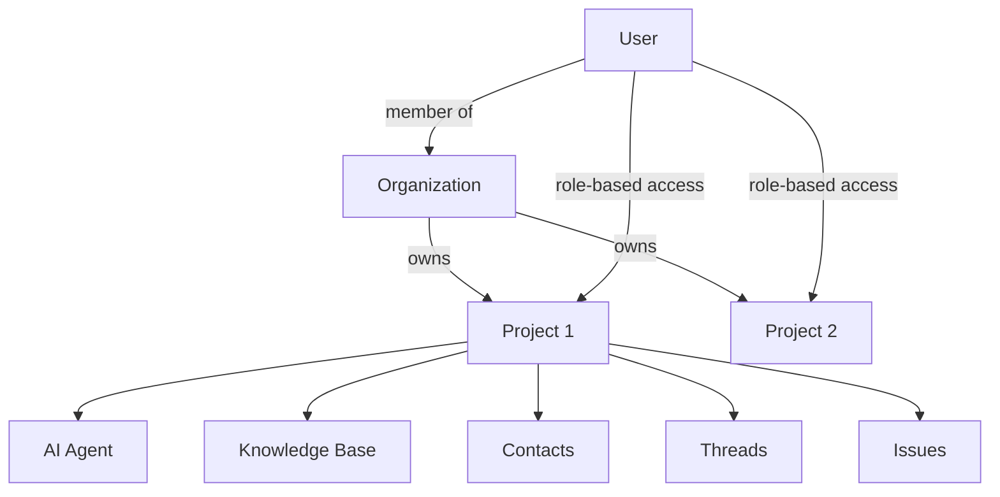

# Agent Maple Console: Product Requirements Document

**Version**: 1.0  
**Date**: February 4, 2026  
**Status**: Draft

---

## 1. Executive Summary

The Agent Maple Console is a **configuration and reporting interface** for managing AI-powered communication agents deployed at construction job sites. It enables operators to oversee agent activity, track root cause issues, configure knowledge bases, and analyze operational metrics.

> [!IMPORTANT]
> The console does **not** handle real-time conversations. AI agents autonomously manage Voice, SMS, and Email interactions. This interface provides **oversight, configuration, and analytics**.

---

## 2. Product Vision

**For** construction project managers and site coordinators  
**Who** need visibility into AI agent operations without managing conversations directly  
**The** Agent Maple Console **is a** configuration and reporting dashboard  
**That** enables deployment, tuning, and oversight of AI agents  
**Unlike** traditional helpdesk software  
**Our product** focuses on root cause resolution and autonomous agent management

---

## 3. User Personas

| Persona | Role | Primary Tasks |
|---------|------|---------------|
| **Site Coordinator** | Day-to-day operations | Monitor threads, escalate issues, review activity |
| **Project Manager** | Cross-site oversight | Analyze trends, manage knowledge, resolve root causes |
| **Org Administrator** | Platform governance | Manage users, billing, usage limits |

---

## 4. Platform Hierarchy



| Entity | Scope | Description |
|--------|-------|-------------|
| **User** | Cross-org | Authenticated human with role-based access to orgs/projects |
| **Organization** | Global | Billing entity, user management, security settings |
| **Project** | Site-level | Physical job site with dedicated AI agent |
| **Thread** | Transactional | Contact + Issue mapping; all communications for one user about one issue |
| **Issue** | Analytical | Root cause problem; links to many Threads (one per affected contact) |

### User Access Model
- Users belong to one or more **Organizations**
- Within an org, users have a **Role**: Owner, Admin, Member, Viewer
- Role determines access level to all projects in the organization
- Future: Project-level role overrides for granular permissions

---

## 5. Functional Requirements

### 5.1 Organization Level

#### FR-ORG-01: Organization Selection
- Display list of organizations user has access to
- Show project count per organization
- Support search/filter for multi-org users

#### FR-ORG-02: Projects Grid
- Display all projects within selected organization
- Show agent status: Online, Syncing, Hibernating, Offline
- Display rollup metrics: open threads, open issues
- Actions: Launch new project, set agent status

#### FR-ORG-03: Team Management
- List organization members with roles
- Invite new users via email
- Assign roles: Owner, Admin, Member, Viewer
- Remove members, revoke access

#### FR-ORG-04: Billing
- Display current subscription plan
- Show usage summary and billing cycle
- Update payment method
- View invoice history

#### FR-ORG-05: Usage Metrics
- Display token consumption (current/limit)
- Show concurrent agent sessions
- Configure usage alerts
- Historical usage charts

#### FR-ORG-06: Organization Settings
- Update organization name
- Configure authentication providers
- Delete organization (with confirmation)

---

### 5.2 Project Level

#### FR-PRJ-01: Triage Explorer (Threads)
- Display all threads for selected project
- Columns: Contact, Subject, Status, Linked Issue, Channels, Activity
- Status values: Done, Needs Response, Waiting
- Actions: View details, escalate, link to issue, resolve

#### FR-PRJ-02: Issues Dashboard
- Display all issues for selected project
- Columns: Issue, Status, Thread Count, Owner, Activity
- Actions: Create issue, assign owner, resolve (cascades to threads)

#### FR-PRJ-03: Knowledge Base
- List all documents/data sources
- Show indexing status per document
- Actions: Upload document, connect source, delete, re-index
- Display ingestion logs

#### FR-PRJ-04: Contacts
- List all contacts for the project
- Show escalation tier (1, 2, 3)
- Actions: Add/edit contact, block contact
- Display thread count per contact

#### FR-PRJ-05: Insights Dashboard
- KPI Cards: Total Threads, Open Issues, Avg Resolution Time, Auto-Resolved %
- Charts: Thread volume trend, channel breakdown
- Table: Top issues by thread count
- Controls: Date range selector, export report

---

### 5.3 Channel Views (Read-Only)

#### FR-CHN-01: Email View
- Display email messages linked to threads
- Show sender, subject, timestamp
- Link to parent thread

#### FR-CHN-02: SMS View
- Display SMS conversations linked to threads
- Show contact, message preview, timestamp

#### FR-CHN-03: Voice View
- Display call logs linked to threads
- Show contact, duration, timestamp
- Access transcripts

---

## 6. Data Models

### Thread
A Thread is the **mapping between one Contact and one Issue**, containing all conversation history.
```
id: UUID
project_id: UUID
contact_id: UUID (required)
issue_id: UUID (required)
status: enum (OPEN, NEEDS_RESPONSE, WAITING, DONE)
created_at: timestamp
updated_at: timestamp
```

### Message
Individual communications within a Thread.
```
id: UUID
thread_id: UUID
channel: enum (VOICE, SMS, EMAIL)
direction: enum (INBOUND, OUTBOUND)
content: text
timestamp: timestamp
```

### Issue
```
id: UUID
project_id: UUID
title: string
status: enum (OPEN, RESOLVED)
owner_id: UUID (nullable)
thread_count: integer
created_at: timestamp
resolved_at: timestamp (nullable)
```

### Project
```
id: UUID
organization_id: UUID
name: string
agent_status: enum (ONLINE, SYNCING, HIBERNATING, OFFLINE)
created_at: timestamp
```

---

## 7. API Requirements

| Endpoint | Method | Description |
|----------|--------|-------------|
| `/organizations` | GET | List user's organizations |
| `/organizations/:id/projects` | GET | List projects in org |
| `/projects/:id/threads` | GET | List threads in project |
| `/projects/:id/issues` | GET | List issues in project |
| `/projects/:id/insights` | GET | Aggregated metrics |
| `/threads/:id` | PATCH | Update thread status |
| `/issues` | POST | Create new issue |
| `/issues/:id` | PATCH | Update issue |

---

## 8. Non-Functional Requirements

| Category | Requirement |
|----------|-------------|
| **Performance** | Dashboard load < 2s, table pagination < 500ms |
| **Availability** | 99.9% uptime SLA |
| **Security** | SOC2 compliance, row-level security, MFA support |
| **Accessibility** | WCAG 2.1 AA compliance |
| **Browser Support** | Chrome, Firefox, Safari, Edge (latest 2 versions) |

---

## 9. MVP Scope

### In Scope (v1.0)
- [x] Organization selection and settings
- [x] Projects grid with agent status
- [x] Threads triage view
- [x] Issues dashboard
- [x] Knowledge base management
- [x] Contacts management
- [x] Insights dashboard with KPIs and charts
- [x] Team/Billing/Usage management

### Out of Scope (Future)
- [ ] Real-time conversation view
- [ ] Agent behavior configuration (prompts, skills)
- [ ] Custom integrations/webhooks
- [ ] White-label theming
- [ ] Mobile app

---

## 10. Success Metrics

| Metric | Target |
|--------|--------|
| **Issue Resolution Rate** | 80% of issues resolved within 7 days |
| **Auto-Resolution Rate** | 85%+ threads resolved without human intervention |
| **Console Adoption** | 90% of site coordinators active weekly |
| **Mean Time to Insight** | < 30s to find relevant thread/issue |

---

## 11. Design References

See [Interactive Prototype](file:///home/jeremy/.gemini/antigravity/brain/243c7fb1-e204-4c8d-9cb5-b9e932b51c22/index.html) for high-fidelity mockups.

| View | Mockup |
|------|--------|
| Organizations | [mockup_organizations.html](file:///home/jeremy/.gemini/antigravity/brain/243c7fb1-e204-4c8d-9cb5-b9e932b51c22/mockup_organizations.html) |
| Projects | [mockup_projects.html](file:///home/jeremy/.gemini/antigravity/brain/243c7fb1-e204-4c8d-9cb5-b9e932b51c22/mockup_projects.html) |
| Threads | [mockup_threads.html](file:///home/jeremy/.gemini/antigravity/brain/243c7fb1-e204-4c8d-9cb5-b9e932b51c22/mockup_threads.html) |
| Issues | [mockup_issues.html](file:///home/jeremy/.gemini/antigravity/brain/243c7fb1-e204-4c8d-9cb5-b9e932b51c22/mockup_issues.html) |
| Insights | [mockup_insights.html](file:///home/jeremy/.gemini/antigravity/brain/243c7fb1-e204-4c8d-9cb5-b9e932b51c22/mockup_insights.html) |
